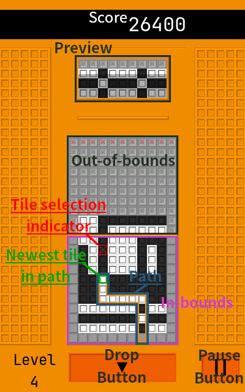

# Duopo
Duopo is a partial simulation of Polarium, a game that released in North America in 2005 for the Nintendo DS. It features one mode of play, Time Mode, which borrows from Polarium's Challenge Mode. Duopo uses Godot Engine v4.1.x.

## Time Mode

Time Mode is a score-attack game mode. Score points by clearing rows of tiles. Each row is cleared after it contains matching colored tiles, ignoring gray tiles. Each row cleared awards 100 points, with an additional 100 points per row cleared at once. 1,000 points are awarded for increasing the level, which occurs after reaching a threshhold for points scored and rows cleared.

The player can change the color of in-bounds tiles from black to white, or white to black, first by creating a path overlayed upon the tiles, then activating the path.

A row(s) of tiles drops into the play area periodically. The player may also choose to drop the row(s) at will, if there is available space. The incoming row(s) are displayed near the top of the game window.

Row(s) may enter the play area faster as level increases. The game ends when a row attempts to drop while the play area is full.

### Mouse Controls

1. To navigate the menu, move the mouse cursor over buttons, then click Mouse 1 / Left Mouse Button to activate the menu option.
2. To select a tile, move the mouse cursor over the tile.
3. To create or extend the path in the direction of the selected tile, click or press Mouse 1 / Left Mouse Button.
4. To erase or shrink the path, select a tile on the path, then click or press Mouse 2 / Right Mouse Button. You can also shrink the path by pressing Mouse 1 / Left Mouse Button on second newest tile in the path.
5. To activate the path and change tiles, select the newest tile in the path, then click Mouse 1 / Left Mouse Button.
6. To drop the next row(s), press the drop button near the bottom-center of the game window.
7. To pause the game, press the pause button near the bottom-right corner of the game window.

### Keyboard Controls

1. To navigate the menu, use the directional or WASD keys to change the selected button and Space or Enter to activate the menu option.
2. To select a tile, use the directional or WASD keys to move the tile selection indicator (a red square with an pulsing animation).
3. To create or extend the path in the direction of the selected tile, tap or press Space.
4. To erase or shrink the path, select a tile on the path, press and hold Shift then tap or press Space. You can also erase the path by pressing and holding Shift, then tapping the up directional key or the W key.
5. To activate the path and change tiles, select the newest tile in the path, then tap Space.
6. To drop the next line(s), press press and hold Shift then tap the down directional key or the S key.
7. To pause the game, press the Esc / Escape key.

#

THE SOFTWARE IS PROVIDED “AS IS”, WITHOUT WARRANTY OF ANY KIND, EXPRESS OR IMPLIED, INCLUDING BUT NOT LIMITED TO THE WARRANTIES OF MERCHANTABILITY, FITNESS FOR A PARTICULAR PURPOSE AND NONINFRINGEMENT. IN NO EVENT SHALL THE AUTHORS OR COPYRIGHT HOLDERS BE LIABLE FOR ANY CLAIM, DAMAGES OR OTHER LIABILITY, WHETHER IN AN ACTION OF CONTRACT, TORT OR OTHERWISE, ARISING FROM, OUT OF OR IN CONNECTION WITH THE SOFTWARE OR THE USE OR OTHER DEALINGS IN THE SOFTWARE.